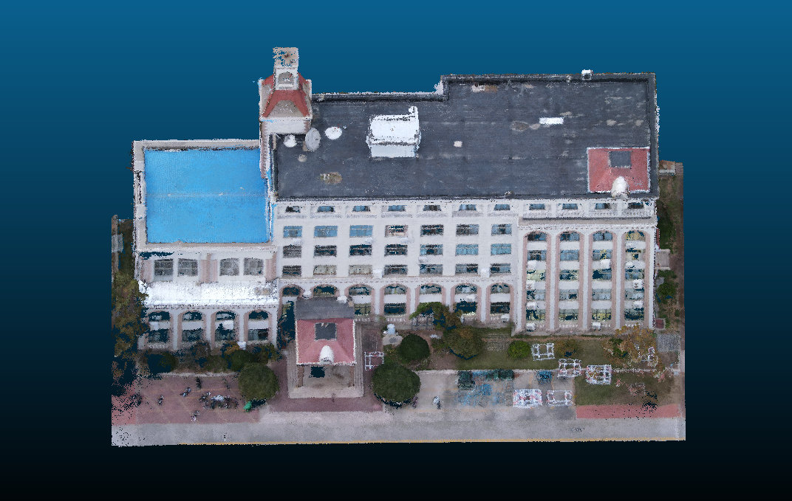

# 3d-building-reconstruction

This is part of a study project using the AA-RMVSNet to reconstruct buildings from multiple images. The other part of the project is
[building-feature-recognition](https://github.com/jshmsjh/building-feature-recognition) and [Swin-Transformer-Object-Detection](https://github.com/jshmsjh/Swin-Transformer-Object-Detection)

## Introduction

It is exciting to connect the 2D world with 3D world using Multi-view Stereo(MVS) methods. In this project, we aim to reconstruct several architecture in our campus. Since it's outdoor reconstruction, We chose to use `AA-RMVSNet` to do this work for its marvelous performance is outdoor datasets after comparing some similar models such as `CasMVSNet` and `D2HC-RMVSNet`. The code is retrieved from [here](https://github.com/QT-Zhu/AA-RMVSNet) with some modification.

## Reproduction

Here we summarize the main steps we took when doing this project. You can reproduce our result after these steps.

### Installation

First, you need to create a virtual environment and install the necessary dependencies.

```
conda create -n test python=3.6
conda activate test
conda install pytorch==1.1.0 torchvision==0.3.0 cudatoolkit=10.0 -c pytorch
conda install -c conda-forge py-opencv plyfile tensorboardx
```

Other cuda versions can be found [here](https://pytorch.org/get-started/previous-versions/)

### Struct from Motion

Camera parameters are required to conduct the MVSNet based methods. Please first download the open source software [COLMAP](https://github.com/colmap/colmap/releases/tag/3.6).

The workflow is as follow:

1. Open the COLMAP, then successively click `reconstruction`-`Automatic reconstruction` options.
2. Select your Workspace folder and Image folder.
3. (Optional) Unclick Dense model to accelerate the reconstruction procedure.
4. Click `Run`.
5. After the completion of reconstruction, you should be able to see the result of sparse reconstruction as well as position of cameras.(Fig )
6. Click `File` - `Export model as text`. There should be a `camera.txt` in the output folder, each line represent a photo. In case there are photos that remain mismatched, you should dele these photos and rematch. Repeat this process until all the photos are mathced.
7. Move the there txts to the `sparse` folder.


### AA-RMVSNet

To use AA-RMVSNet to reconstruct the building, please follow the steps listed below.

1. Clone this repository to a local folder. 

2. The custom testing folder should be placed in the root directory of the cloned folder. This folder should have to subfolders names `images` and `sparse`. The `images` folder is meant to place the photos, and the `sparse` folder should have the three txt files recording the camera's parameters.

3. Find the file `list-dtu-test.txt`, and write the name of the folder which you wish to be tested. 

4. Run `colmap2mvsnet.py` by

    ```
    python ./sfm/colmap2mvsnet.py --dense_folder name --interval_scale 1.06 --max_d 512
    ```

    The parameter `dense_folder` is compulsory, others being optional. You can also change the default value in the following shells.

5. When you get the result of the previous step, run the following commands

    ```
    sh ./scripts/eval_dtu.sh
    sh ./scripts/fusion_dtu.sh
    ```

6. Then you are should see the output  `.ply` files in the `outputs_dtu` folder.

Here dtu means the data is organized in the format of [DTU](http://roboimagedata.compute.dtu.dk/?page_id=36) dataset.

## Results

We reconstructed various spot of out campus. The reconstructed point cloud files is available [here](https://pan.baidu.com/s/1K0ejPfeU8KmnOYaLLU07KQ ) (Code: nz1e). You can visualize the file with [Meshlab](https://www.meshlab.net/) or [CloudCompare](https://www.danielgm.net/cc/) .


